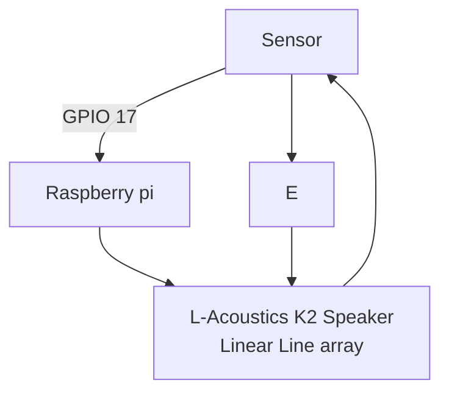

# Headers 
This is for **heading 1**

## Heading 2
This is for *heading 2*

### Heading 3
This is for ***heading 3*** 

# List

This is how you list items in markdown
1. member 1
    * Team leader
        * Project owner
2. member 2
    * Team leader

3. member 3
    * Team leader

4. member 4
    * Team leader


# Inserting an image

To insert an image you will need to drag + hold shift + drop


[click here to link](https://www.google.com)

[Click here to jump to test.md](/test/test.md)


# Code block

To highlight or insert a particular section of code , you can do the following

1. In rasp pi , if you want to update you will `sudo apt update`

``` 
from tkinter import *

main = Tk()

main.mainloop()

```

# Quotes

A famous quote by **Sir Issac Newton**
> For every action , there will be a reaction

# Tables 

This is how you insert tables

|Header A|Header B|Header C|
|-----|----|-----| 
|Row 1|Data A|Data B|
|Row 2|Data C|Data D|

```
|-----:|This is to justify right
min 3 dash

flowcharts - graph TD ( top down) / LR (LEFT RIGHT)
mermaid and graph TD/LR must be in diff line


sequence diag
-->> dotted line
->> solid line


```

# Horizontal Rule

This is how to insert a section line 

---

# Flowchart


# Sequence diagram

``` mermaid
sequenceDiagram;

Alice->> Bob: Hello , How are you
Bob -->> Alice : I am good thanks
Alice ->> Charlie : Have you eaten
Charlie -->> Alice: No i have not


